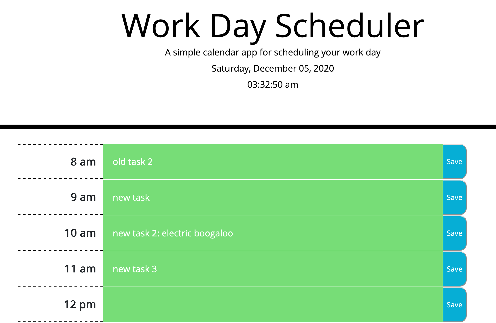

# Ideal Day Planner

This day planner is structured using Bootstrap's grid system. Each div with the `.row.` class is assigned a numerical ID from 8 to 18, corresponding to the hour that row represents. Those IDs match property names that contain the `textContent` of each row and allow for straightforward data handling, such as in for loops, where operations can be performed with `$("#" + i)` to handle each row.

Clicking on a row gets the text in that row, creates a textarea, then sets its value to the text that was previously there. The save button essentially reverses this sequence of events to update the planner. The save buttons are functionally aligned with their row via jQuery traversal methods, such as:

```js
let targetRow = $(event.target).parent().siblings(".schedule-text");
let newText = targetRow.children("textarea").val().trim();
```

